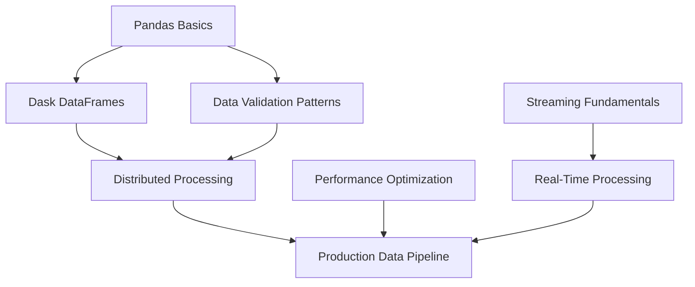

# Advanced Data Professional Learning Path Design

**Date:** 2025-11-30  
**Purpose:** Create a meta-processing toolkit and personalized advanced learning curriculum  
**Target Learner:** Experienced Python developer advancing in Data Engineering, Data Science, Visualization, and Clean Code

---

## Executive Summary

This design outlines three deliverables:

1. **Meta-Skills Directory**: Claude-style process skills documenting HOW to extract skills from technical PDFs and build learning curricula
2. **Advanced Learning Path**: Project-based curriculum for sustained learning (2-3 hours/week over 3-6 months) focused on Data Engineering, Data Science, Visualization, and Clean Code
3. **Learning Graph Outline**: Skill taxonomy showing relationships, prerequisites, and categories (foundation for curriculum)

**Theme:** StoryBoard Analytics 🐗 - A fictional multi-channel bookstore generating realistic data for practice projects

---

## Repository Structure

### Current vs. Proposed

**Reorganization into 4 distinct areas:**

```
python_teaching/
├── bootcamp/                          # Area 1: Python Teaching (beginner)
│   ├── day-01/ through day-21/       # Existing bootcamp content (moved from docs/)
│   ├── datasets/                      # Synthetic data (Page Turner Analytics)
│   ├── _config.yml                    # Jupyter Book config
│   └── _toc.yml
│
├── meta/                              # Area 2: Meta-Processing Toolkit
│   ├── skills/                        # NEW: Claude-style process skills
│   │   ├── pdf-to-markdown.md
│   │   ├── skill-extraction-via-llm.md
│   │   ├── skill-graph-construction.md
│   │   ├── curriculum-design.md
│   │   └── project-spec-generation.md
│   │
│   ├── scripts/                       # Processing scripts (moved from root)
│   │   ├── pdf_to_markdown.py
│   │   ├── skill_extractor.py
│   │   ├── graph_builder.py          # NEW
│   │   ├── curriculum_generator.py   # NEW
│   │   ├── config.py
│   │   └── data_generation/          # NEW: StoryBoard Analytics data
│   │       ├── fetch_real_books.py
│   │       ├── generate_customers.py
│   │       ├── generate_transactions.py
│   │       ├── generate_reviews.py
│   │       ├── generate_inventory.py
│   │       └── export_formats.py
│   │
│   ├── templates/                     # NEW: Reusable templates
│   │   ├── skill-schema.json
│   │   ├── project-spec-template.md
│   │   └── curriculum-template.md
│   │
│   └── prompts/                       # Existing LLM prompts
│       └── skill_extraction.txt
│
├── learning-paths/                    # NEW: All learning paths organized
│   ├── beginner-bootcamp/            # Symlink to ../bootcamp/
│   ├── interview-prep/               # Area 3: Big Data Interview Prep (moved)
│   └── advanced-data-pro/            # Area 4: Advanced Learning Path (NEW)
│       ├── 00-overview.md
│       ├── 01-skill-graph.md
│       ├── 02-curriculum.md
│       └── projects/
│           ├── 01-streaming-pipeline/
│           │   ├── README.md         # Project spec
│           │   ├── data-samples/     # StoryBoard Analytics data
│           │   └── evaluation.md
│           ├── 02-distributed-processing/
│           ├── 03-nlp-service/
│           └── 04-production-ml/
│
├── references/                        # Existing (unchanged)
│   ├── *.pdf                         # 26 technical PDFs
│   ├── markdown/                     # Converted markdown
│   └── _skill_taxonomy/              # Extracted skills (JSON)
│
├── docs/                             # Documentation (design docs only)
│   └── plans/                        # Design documents
│
├── pyproject.toml
└── README.md                         # Updated overview
```

---

## Deliverable 1: Meta-Skills Directory

### Purpose
Document the PROCESS of extracting skills and building curricula so it's reusable for future projects.

### Skills to Create

#### 1. `meta/skills/pdf-to-markdown.md`
**Purpose:** Convert technical PDFs to clean, structured markdown

**Key Sections:**
- When to use this skill (technical books, code preservation needs)
- PDF extraction tools comparison:
  - pypdf (lightweight, basic text extraction)
  - pdfplumber (tables, layout preservation)
  - marker (ML-based, handles complex layouts)
- Chunking strategies for large documents (chapter-based vs page-based vs size-based)
- LLM prompt templates for markdown conversion
- Code block detection and language tagging
- Quality validation checklist
- Common issues and solutions:
  - OCR artifacts (garbled text, spacing issues)
  - Table preservation (converting to markdown tables)
  - Image/diagram handling
  - Page header/footer removal

#### 2. `meta/skills/skill-extraction-via-llm.md`
**Purpose:** Extract structured skills from markdown content using LLMs

**Key Sections:**
- Skill schema definition with emphasis on relationships:
  ```json
  {
    "skill_id": "unique_identifier",
    "skill_name": "Human-readable skill name",
    "category": "data_engineering | data_science | visualization | clean_code | etc.",
    "subcategory": "specific area within category",
    "tags": ["technical", "keywords", "tools", "libraries"],
    "prerequisites": ["skill names that must be learned first"],
    "related_skills": ["complementary or building-upon skills"],
    "difficulty": "beginner | intermediate | advanced",
    "description": "What this skill enables you to do",
    "learning_resources": ["Book: Chapter X", "Article: URL"]
  }
  ```
- Prompt engineering for skill extraction
  - Few-shot examples for consistency
  - Emphasis on extracting prerequisites and relationships
- Chunk size optimization (context window vs accuracy trade-offs)
- Difficulty classification criteria:
  - Beginner: Foundational, no complex prerequisites
  - Intermediate: Builds on 2-3 foundational skills
  - Advanced: Requires deep knowledge of multiple areas
- Skill categorization taxonomy:
  - Data Engineering: pipelines, streaming, distributed systems, orchestration
  - Data Science: statistics, ML, modeling, analysis
  - Visualization: dashboards, charts, storytelling
  - Clean Code: architecture, performance, testing, design patterns
  - Distributed Systems: parallelism, fault tolerance, scalability
- Skill dependency detection strategies:
  - Explicit mentions in text ("requires understanding of X")
  - Implicit dependencies (topic analysis, keyword co-occurrence)
  - LLM reasoning with validation
- Related skills identification:
  - Same category, different approach (Dask vs Ray)
  - Complementary skills (streaming + visualization)
  - Progressive depth (basic → advanced versions)
- Tag extraction for searchability and clustering
- Batch processing strategies (parallel extraction, rate limiting)
- Validation rules:
  - Required fields present
  - No circular dependencies
  - Difficulty progression makes sense (prerequisites easier than dependent skill)
  - Consistency checks across extractions

#### 3. `meta/skills/skill-graph-construction.md`
**Purpose:** Build dependency graph from extracted skills

**Key Sections:**
- Graph data structure:
  - Nodes: skills with metadata
  - Edges: prerequisite relationships (directed)
  - Attributes: category clusters, difficulty levels
- Detecting implicit prerequisites:
  - Keyword analysis (if skill mentions "pandas DataFrame" → prerequisite: "pandas basics")
  - LLM-assisted gap filling
  - Expert review checkpoints
- Cycle detection and resolution:
  - Topological sort algorithms
  - Breaking cycles (identifying which dependency is weaker)
- Topological sorting for learning sequences:
  - Multiple valid orderings
  - Difficulty-aware sorting (easier skills first)
- Clustering skills by category/theme:
  - Graph community detection
  - Manual categorization validation
- Identifying learning milestones:
  - Skills that unlock many downstream skills (critical path)
  - Natural breakpoints for projects
- Graph visualization options:
  - Mermaid diagrams (markdown-embeddable)
  - Graphviz DOT (detailed, exportable)
  - Interactive (D3.js, Cytoscape)
- Export formats:
  - JSON (programmatic access)
  - Markdown (human-readable)
  - CSV (spreadsheet analysis)

#### 4. `meta/skills/curriculum-design.md`
**Purpose:** Generate project-based learning curriculum from skill graph

**Key Sections:**
- Target learner profiling:
  - Current skill level (baseline assessment)
  - Learning goals (depth vs breadth)
  - Time commitment (hours/week)
  - Preferred learning style (reading vs doing)
- Project scaffolding strategy:
  - Identify skill clusters (4-6 skills that work together)
  - Map clusters to realistic project themes
  - Ensure projects build on each other (progressive complexity)
- Project-based learning design:
  - Each project targets a skill cluster
  - Realistic scenarios (not toy problems)
  - Spec-based (requirements, not solutions)
  - Clear deliverables
- Difficulty progression:
  - Start with intermediate (skip beginner for experienced learners)
  - Gradually increase complexity
  - Mix of familiar and novel concepts in each project
- Spec-based project requirements template:
  - Context/scenario
  - Functional requirements
  - Non-functional requirements (performance, code quality)
  - Acceptance criteria
  - Extension ideas
- Learning milestone definition:
  - Checkpoints between projects
  - Self-assessment criteria
  - Portfolio piece outcomes
- Time estimation per project:
  - Reading time (PDF chapters)
  - Planning time (design, architecture)
  - Implementation time (coding, testing)
  - Buffer for learning curve
- Integration with reading materials:
  - Which PDF chapters to read before each project
  - Reference sections during implementation
- Assessment criteria design:
  - Functional completeness
  - Code quality (clean code principles)
  - Performance benchmarks
  - Documentation clarity

#### 5. `meta/skills/project-spec-generation.md`
**Purpose:** Create spec-based project requirements from skill clusters

**Key Sections:**
- Spec template structure:
  ```markdown
  # Project Title
  
  ## Context
  Business scenario and motivation
  
  ## Learning Objectives
  Skills you'll practice in this project
  
  ## Requirements
  ### Functional Requirements
  - What the system must do
  
  ### Non-Functional Requirements
  - Performance targets
  - Code quality standards
  - Documentation expectations
  
  ## Acceptance Criteria
  Specific, testable conditions for completion
  
  ## Deliverables
  - Code repository structure
  - Documentation
  - Test coverage
  
  ## Data
  - Sample datasets provided
  - Expected data volumes
  
  ## Extension Ideas
  Optional enhancements for deeper learning
  ```
- Realistic data/scenario generation:
  - Use StoryBoard Analytics universe
  - Real-world data volumes and complexity
  - Authentic business problems
- Deliverable definition:
  - Code (quality over quantity)
  - Documentation (README, architecture decisions)
  - Tests (coverage expectations)
  - Optional: deployment, performance benchmarks
- Skill integration strategies:
  - Natural combinations (streaming + data validation)
  - Forced integration for learning (visualization + distributed computing)
  - Progressive depth (project 1 uses skill at basic level, project 3 uses it advanced)
- Validation criteria:
  - Functional tests (does it work?)
  - Performance benchmarks (does it scale?)
  - Code review checklist (is it clean?)
- Extension ideas for deeper learning:
  - Optional features that push skills further
  - Integration with other projects
  - Production-readiness enhancements

---

## Deliverable 2: Advanced Learning Path Curriculum

### Target Learner Profile
- **Current Level:** Experienced Python developer
- **Focus Areas:** Data Engineering, Data Science, Visualization, Clean Code
- **Time Commitment:** 2-3 hours/week over 3-6 months
- **Learning Style:** Project-based, spec-driven (plan then implement)
- **Tools:** May use AI tools for code-along, but wants to read and plan first

### PDF Focus (Advanced Books)
- **Data Engineering:**
  - Financial Data Engineering
  - Implementing Data Mesh
  - Streaming Databases
  - Enterprise Data Catalog
  - Scaling Python with Dask
  - Scaling Python with Ray

- **Data Science & Statistics:**
  - Practical Statistics for Data Scientists
  - Data Science from Scratch 2nd Edition
  - Data Science The Hard Parts
  - Bayesian Statistics The Fun Way

- **Visualization:**
  - Book of Dash

- **Clean Code:**
  - Write Great Code (Volumes 1-3)

- **Specialized Applications:**
  - Natural Language Processing with Python and SpaCy
  - Practical Deep Learning Introduction

### Curriculum Structure

#### `learning-paths/advanced-data-pro/00-overview.md`
**Content:**
- Learning path purpose: Advance from Python proficiency to data professional expertise
- Core focus: Data Engineering, Data Science, Visualization, Clean Code
- Time commitment: 2-3 hours/week over 3-6 months (~50-70 hours total)
- Expected outcomes:
  - 4-6 portfolio-quality projects
  - Deep knowledge of distributed computing, streaming, NLP, production ML
  - Clean code habits for production systems
- How to use this path:
  1. Read assigned PDF chapters
  2. Review project spec
  3. Plan architecture and approach
  4. Implement (with or without AI assistance)
  5. Self-assess against criteria
- Recommended environment setup:
  - Python 3.11+
  - uv package manager
  - Docker for local testing
  - Git for version control
  - IDE with strong Python support

#### `learning-paths/advanced-data-pro/01-skill-graph.md`
**Content:**
- Visual skill dependency graph (Mermaid diagram)
- Skill categories with counts:
  - Data Engineering: 18 skills
  - Data Science: 15 skills
  - Visualization: 8 skills
  - Clean Code: 12 skills
  - Distributed Systems: 10 skills
  - NLP: 7 skills
- Prerequisite chains (what unlocks what)
- Skill clusters mapped to projects
- PDF coverage map (which skills from which books)

**Example structure:**
```markdown
## Skill Categories

### Data Engineering (18 skills)
- Streaming data processing (Streaming Databases)
- Distributed computing with Dask (Scaling Python with Dask)
- Distributed computing with Ray (Scaling Python with Ray)
- Data pipeline orchestration
- Data quality validation
- Data mesh architecture (Implementing Data Mesh)
- ...

### Clean Code (12 skills)
- Performance optimization (Write Great Code Vol 2)
- Memory management (Write Great Code Vol 1)
- Low-level optimization (Write Great Code Vol 2)
- Code architecture patterns (Write Great Code Vol 1)
- ...

## Dependency Graph
[Mermaid diagram showing skill relationships]

## Learning Clusters
**Cluster 1 (Project 1): Streaming & Data Quality**
- Streaming data processing
- Data validation patterns
- Performance optimization basics
- Time-series aggregation

**Cluster 2 (Project 2): Distributed Computing**
- Dask dataframes
- Parallel processing patterns
- Memory optimization
- Distributed debugging
```

#### `learning-paths/advanced-data-pro/02-curriculum.md`
**Content:**
- Sequenced learning plan (4-6 major projects)
- Each project includes:
  - Project name and overview
  - Skills covered (with links to skill graph)
  - Estimated time
  - PDF reading list (specific chapters)
  - Project spec reference
  - Success criteria

**Example project:**
```markdown
### Project 1: Real-Time Book Sales Analytics Pipeline
**Duration:** 3-4 weeks (8-12 hours)
**Skills Covered:**
- Streaming data processing ([link to skill graph])
- Data validation patterns ([link])
- Time-series aggregation ([link])
- Performance optimization basics ([link])

**Reading (before starting):**
- Streaming Databases: Chapters 1-3 (streaming fundamentals)
- Write Great Code Vol 2: Chapter 5 (performance measurement)
- Financial Data Engineering: Chapter 2 (data validation)

**Project Spec:** [projects/01-streaming-pipeline/README.md](projects/01-streaming-pipeline/README.md)

**Scenario:** StoryBoard Analytics needs a real-time pipeline to process book sales events from 50+ stores, validate data quality, aggregate metrics (revenue, inventory, trends), and expose results via API.

**What You'll Build:**
- Event ingestion system (handles 1000+ events/second)
- Data validation layer (catches malformed events, enforces schema)
- Real-time aggregation engine (revenue by store, genre trends, inventory alerts)
- REST API for querying current metrics
- Monitoring dashboard (basic visualization)

**Success Criteria:**
- ✅ Handles sustained load of 1000+ events/second
- ✅ Data validation catches and logs malformed events (no crashes)
- ✅ Aggregations update within 100ms of event arrival
- ✅ Clean, well-documented code following Write Great Code principles
- ✅ API responds within 50ms for standard queries
- ✅ Basic monitoring shows throughput and error rates

**Extension Ideas:**
- Add exactly-once processing semantics
- Implement backpressure handling
- Add anomaly detection (unusual sales patterns)
- Deploy to cloud with auto-scaling
```

#### `learning-paths/advanced-data-pro/projects/` Structure

Each project directory contains:
```
projects/01-streaming-pipeline/
├── README.md              # Full project spec (context, requirements, criteria)
├── data-samples/          # StoryBoard Analytics sample data
│   ├── sales_events.jsonl      # Sample event stream
│   ├── books_catalog.csv       # Real book data (from Open Library)
│   ├── stores_metadata.json    # Store locations and info
│   └── expected_output.json    # What correct aggregations look like
└── evaluation.md          # Self-assessment rubric
```

**Sample projects (4-6 total):**
1. **Real-Time Book Sales Analytics Pipeline** (streaming, validation, performance)
2. **Distributed Customer Analytics with Dask** (distributed computing, large datasets, memory optimization)
3. **NLP-Powered Review Analysis Service** (NLP, API design, production ML)
4. **Production ML Recommendation Engine** (ML lifecycle, A/B testing, monitoring)
5. **Data Mesh Implementation** (Optional: architecture, governance, team collaboration)
6. **Interactive Analytics Dashboard** (Optional: Dash, visualization, storytelling)

---

## Deliverable 3: Learning Graph Outline

### Purpose
Foundation for curriculum design - shows what skills exist and how they relate.

### Structure

The skill graph is represented in `01-skill-graph.md` with:

**Skill Categories:**
- Data Engineering
- Data Science
- Visualization
- Clean Code
- Distributed Systems
- NLP
- Production ML

**For Each Skill:**
- Skill name
- Category and subcategory
- Difficulty level
- Prerequisites (what to learn first)
- Related skills (complementary topics)
- Tags (tools, libraries, patterns)
- Source (which PDF, which chapter)

**Graph Visualization:**
- Mermaid diagram showing:
  - Nodes = skills (color-coded by category)
  - Edges = prerequisite relationships (directed arrows)
  - Clusters = natural project groupings

**Example (simplified):**


**Output Format:**
- Markdown file with embedded Mermaid
- JSON export for programmatic access
- CSV for spreadsheet analysis

This outline will be **filled in during execution** (future iteration) but designed now to guide the curriculum structure.

---

## Data Strategy: StoryBoard Analytics Universe 🐗

### Fictional Company
**StoryBoard Analytics**
- Mascot: Wally the Warthog (data-driven, tough, sharp tusks for cutting through insights)
- Business: Multi-channel bookstore (physical stores, e-commerce, subscription boxes)
- Scale: 50+ store locations, 500K active customers, 2M books sold annually
- Differentiator: Data-driven personalization and recommendation engine

### Real-World Data Sources (for Realism)

**Source 1: Open Library API**
- Real book metadata: titles, authors, ISBNs, publication dates, page counts
- Categories/subjects for genre classification
- Cover images (optional)
- API: https://openlibrary.org/developers/api
- Target: 100K real books as catalog foundation

**Source 2: Goodreads/Google Books (where available)**
- Average ratings (proxy for quality/popularity)
- Review counts
- Book descriptions

**Source 3: Project Gutenberg**
- 50K+ public domain books with full text
- For NLP projects requiring actual book content
- Metadata: https://www.gutenberg.org/

**Source 4: ISBN Database (OpenLibrary)**
- Publisher information
- Format types (hardcover, paperback, ebook, audiobook)
- Pricing data (retail prices)

### Synthetic Data Generation Strategy

**Base Data (seed from real sources):**
- 100K real books from Open Library API
  - Real titles, authors, ISBNs
  - Real genres, publication years
  - Realistic metadata (page counts, formats)
- Augment with pricing, inventory, promotions

**Generated Transaction Data (StoryBoard Analytics-specific):**
- Customer purchase patterns (realistic distributions)
  - Bestseller concentration (Zipf distribution: 20% of books = 80% of sales)
  - Genre preferences by customer segment
  - Browse-to-buy conversion rates (industry typical: 2-5%)
- Seasonal trends:
  - Holiday spikes (November-December 3x baseline)
  - Summer reading (June-August genre shifts)
  - Back-to-school (August-September textbook surge)
- Store location demographics:
  - Urban vs suburban vs college town
  - Regional preferences (Southern book clubs, West Coast tech)
- Pricing strategies:
  - Discounts (seasonal, clearance, loyalty rewards)
  - Promotions (buy-2-get-1, staff picks)
  - Dynamic pricing experiments
- Inventory levels and restocking patterns:
  - Lead times (publishers, distributors)
  - Safety stock calculations
  - Out-of-stock simulations
- StoryBoard subscription service:
  - Monthly book box themes
  - Personalized recommendations
  - Churn modeling data

**Data Quality Issues (injected realistically):**
- Missing values (~2-5% of records, specific patterns)
- Duplicate customer records (name variations, multiple emails)
- Outliers (data entry errors, fraudulent transactions)
- Inconsistent formatting (date formats, phone numbers)
- Schema violations (negative prices, future dates)

### Data Volumes by Project

**Project 1: Streaming Pipeline**
- 1M+ sales transactions (2 years of history)
- 10K actively sold books
- 50 store locations
- Real-time event stream: 500-2000 events/second during peak
- Event types: sale, return, inventory_update, price_change

**Project 2: Distributed Processing**
- 5M+ customer interactions (browsing, cart, purchase)
- 50K books in full catalog
- 200K StoryBoard customers
- Multi-GB datasets (3-5 GB CSV, 1-2 GB Parquet)
- Distributed computation targets (10-20 partitions)

**Project 3: NLP Service**
- 500K customer reviews (realistic text, LLM-assisted generation)
- 10K book descriptions (from real books via APIs)
- Author biographies (from Open Library)
- Sentiment analysis ground truth (subset hand-labeled)
- Topic modeling corpus

**Project 4: Production ML**
- Full dataset: 100K books, 500K customers, 5M interactions
- Recommendation engine training data:
  - User-item interaction matrix (sparse)
  - Content features (book metadata)
  - Contextual features (time, location, device)
- A/B test simulation data:
  - Control vs treatment groups
  - Conversion metrics
- Model performance tracking:
  - Precision@K, Recall@K, NDCG
  - Online vs offline metrics

### Data Generation Scripts

**Location:** `meta/scripts/data_generation/`

```
data_generation/
├── fetch_real_books.py        
│   # Pull from Open Library API
│   # Fetch 100K books with metadata
│   # Cache locally to avoid repeated API calls
│   # Output: references/data/books_catalog.csv
│
├── generate_customers.py      
│   # Realistic StoryBoard customer profiles
│   # Demographics, purchase history, preferences
│   # Output: references/data/customers.csv
│
├── generate_transactions.py   
│   # Purchase patterns with seasonal trends
│   # Zipf distribution for bestsellers
│   # Store location correlations
│   # Output: references/data/transactions.csv
│
├── generate_reviews.py        
│   # NLP-ready review text (LLM-assisted)
│   # Sentiment labels, star ratings
│   # Realistic length/quality distribution
│   # Output: references/data/reviews.jsonl
│
├── generate_inventory.py      
│   # Stock levels per store
│   # Restocking events, lead times
│   # Out-of-stock simulations
│   # Output: references/data/inventory.csv
│
└── export_formats.py          
    # Convert to multiple formats
    # CSV, JSON, Parquet, streaming (JSONL)
    # Project-specific subsets
```

### Data Quality Standards

**Realism Requirements:**
- ✅ Real book titles, authors, ISBNs (no "Book 1", "Book 2")
- ✅ Realistic pricing ($8-$45 for most books, $60-$150 for textbooks)
- ✅ Plausible sales patterns (Zipf distribution: bestsellers dominate)
- ✅ Seasonal trends match real book industry (holiday spikes, summer lulls)
- ✅ Customer behavior follows known patterns (browse-to-buy ~3%)
- ✅ Data quality issues injected realistically (2-5% missing, duplicates, outliers)
- ✅ Inventory follows supply chain realities (lead times, safety stock)

**Data Freshness Plan:**
- **Initial generation:** Create full dataset (100K books, 500K customers, 5M interactions)
- **Update script:** Quarterly refresh from APIs to include new book releases
- **Version control:** Tag datasets by generation date (e.g., `storyboard_2025_q4`)
- **Reproducibility:** Seed random generators for consistent test data

---

## Execution Workflow

### Phase 1: Create Meta-Skills (Document the Process)
**Duration:** 1-2 days

**Tasks:**
1. Write `meta/skills/pdf-to-markdown.md`
   - Document PDF extraction tools
   - Markdown conversion best practices
   - Quality validation checklists

2. Write `meta/skills/skill-extraction-via-llm.md`
   - Define skill schema (with relationships)
   - Prompt engineering for extraction
   - Dependency detection strategies

3. Write `meta/skills/skill-graph-construction.md`
   - Graph algorithms (topological sort, cycle detection)
   - Clustering and milestone identification
   - Visualization approaches

4. Write `meta/skills/curriculum-design.md`
   - Project scaffolding from skill clusters
   - Difficulty progression strategies
   - Time estimation methods

5. Write `meta/skills/project-spec-generation.md`
   - Spec template and structure
   - Realistic scenario creation
   - Assessment criteria design

**Output:** 5 meta-skills documented in Claude-style markdown format

---

### Phase 2: Execute Using Meta-Skills (Build Your Learning Path)
**Duration:** 1-2 weeks

**Step 2.1: Convert Advanced PDFs to Markdown**
- Follow `meta/skills/pdf-to-markdown.md`
- Target PDFs: 16 advanced books (data engineering, statistics, clean code, NLP)
- Output: `references/markdown/{book-name}/full_content.md`

**Step 2.2: Extract Skills from Markdown**
- Follow `meta/skills/skill-extraction-via-llm.md`
- Use Azure OpenAI (gpt-5-chat or gpt-5-mini)
- Extract skills with dependencies, tags, categories
- Output: `references/_skill_taxonomy/{book-name}_skills.json`

**Step 2.3: Build Skill Graph**
- Follow `meta/skills/skill-graph-construction.md`
- Consolidate skills from all books
- Detect implicit dependencies
- Generate Mermaid diagram
- Output: `learning-paths/advanced-data-pro/01-skill-graph.md`

**Step 2.4: Design Curriculum**
- Follow `meta/skills/curriculum-design.md`
- Identify 4-6 skill clusters
- Map clusters to projects
- Sequence projects by difficulty
- Output: `learning-paths/advanced-data-pro/02-curriculum.md`

**Step 2.5: Generate Project Specs**
- Follow `meta/skills/project-spec-generation.md`
- Create detailed specs for each project
- Define requirements, acceptance criteria, deliverables
- Output: `learning-paths/advanced-data-pro/projects/*/README.md`

---

### Phase 3: Data Generation (StoryBoard Analytics Universe)
**Duration:** 3-5 days

**Step 3.1: Fetch Real Book Data**
- Run `meta/scripts/data_generation/fetch_real_books.py`
- Pull 100K books from Open Library API
- Cache locally for reuse
- Output: `references/data/books_catalog.csv`

**Step 3.2: Generate Synthetic Data**
- Run `meta/scripts/data_generation/generate_customers.py`
- Run `meta/scripts/data_generation/generate_transactions.py`
- Run `meta/scripts/data_generation/generate_reviews.py`
- Run `meta/scripts/data_generation/generate_inventory.py`
- Output: StoryBoard Analytics datasets in `references/data/`

**Step 3.3: Create Project-Specific Datasets**
- Run `meta/scripts/data_generation/export_formats.py`
- Generate project-specific subsets (streaming events, NLP corpus, etc.)
- Multiple formats (CSV, JSON, Parquet, JSONL)
- Output: `learning-paths/advanced-data-pro/projects/*/data-samples/`

**Step 3.4: Validate Data Quality**
- Check realism (real books, plausible patterns)
- Verify data volumes match targets
- Test data quality issues are realistic
- Document data generation process

---

### Phase 4: Repository Restructuring
**Duration:** 1 day

**Step 4.1: Move Existing Content**
- Rename `docs/` → `bootcamp/`
- Move `scripts/` → `meta/scripts/`
- Move `demos/interview_prep/` → `learning-paths/interview-prep/`
- Create `learning-paths/beginner-bootcamp/` (symlink to `bootcamp/`)

**Step 4.2: Update Paths and References**
- Update imports in Python scripts
- Update paths in Jupyter notebooks
- Update Jupyter Book config (`_config.yml`, `_toc.yml`)
- Update README links

**Step 4.3: Create New Directories**
- Create `meta/skills/`, `meta/templates/`
- Create `learning-paths/advanced-data-pro/`
- Create `docs/plans/` (move existing design docs)

**Step 4.4: Update Documentation**
- Update main README.md with new structure
- Document the 4 distinct areas
- Add navigation guide
- Update .gitignore if needed

---

## Success Criteria

### Deliverable 1: Meta-Skills Directory
- ✅ 5 meta-skills written in Claude-style markdown
- ✅ Skills are reusable for future PDF processing projects
- ✅ Skills document actual process (not theoretical)
- ✅ Located in `meta/skills/`

### Deliverable 2: Advanced Learning Path
- ✅ Curriculum designed for experienced Python developer
- ✅ 4-6 project-based learning modules
- ✅ Projects use spec-based approach (requirements, not solutions)
- ✅ Focused on Data Engineering, Data Science, Visualization, Clean Code
- ✅ Sequenced for 2-3 hours/week over 3-6 months
- ✅ All projects use StoryBoard Analytics realistic data
- ✅ Clear success criteria and self-assessment rubrics

### Deliverable 3: Learning Graph Outline
- ✅ Skill taxonomy extracted from advanced PDFs
- ✅ Skills show prerequisites, related skills, categories, tags
- ✅ Dependency graph visualized (Mermaid diagram)
- ✅ Skill clusters mapped to projects
- ✅ Located in `learning-paths/advanced-data-pro/01-skill-graph.md`

### Overall
- ✅ Repository restructured into 4 distinct areas
- ✅ StoryBoard Analytics data generated with real book metadata
- ✅ All paths updated, nothing broken
- ✅ Documentation clear and navigable

---

## Dependencies

### Python Packages
```toml
[project.dependencies]
pandas = ">=2.0.0"
numpy = ">=1.24.0"
matplotlib = ">=3.7.0"
seaborn = ">=0.12.0"
plotly = ">=5.14.0"
jupyter = ">=1.0.0"
openai = ">=1.0.0"          # Azure OpenAI SDK
python-dotenv = ">=1.0.0"
pdfplumber = ">=0.9.0"      # PDF processing
pypdf = ">=3.0.0"           # Alternative PDF processing
requests = ">=2.31.0"       # API calls (Open Library)
dask = ">=2023.0.0"         # For distributed processing projects
ray = ">=2.0.0"             # For distributed processing projects
dash = ">=2.0.0"            # For visualization projects
spacy = ">=3.5.0"           # For NLP projects
```

### External Services
- Azure OpenAI API (gpt-5-chat, gpt-5-mini for generation)
- Open Library API (free, no auth required)
- Project Gutenberg (free, public domain books)

---

## Timeline Estimate

**Total Duration:** 2-3 weeks for full setup

| Phase | Duration | Outcome |
|-------|----------|---------|
| Phase 1: Create Meta-Skills | 1-2 days | 5 documented process skills |
| Phase 2: Execute Using Meta-Skills | 1-2 weeks | Curriculum, skill graph, project specs |
| Phase 3: Data Generation | 3-5 days | StoryBoard Analytics datasets |
| Phase 4: Repository Restructuring | 1 day | Clean, organized repo |

**After Setup:** Begin learning path (3-6 months, 2-3 hours/week)

---

## Future Enhancements

1. **Interactive Skill Graph Explorer:** Web UI to browse skills, filter by category, visualize dependencies
2. **Automated Progress Tracking:** Track completed projects, skills mastered, time invested
3. **Portfolio Website:** Auto-generate portfolio site from completed projects
4. **Meta-Skill Testing:** Validate meta-skills by applying to different PDF set (e.g., web development books)
5. **Community Contributions:** Open-source the meta-skills for others to use/improve
6. **LLM-Assisted Learning:** Chatbot that references skill graph and PDFs to answer questions
7. **Adaptive Curriculum:** Adjust project difficulty based on completion time and quality

---

## Notes

- This design prioritizes **meta-first documentation** (Approach B) to ensure the process is reusable
- StoryBoard Analytics 🐗 provides continuity with the existing bootcamp (Page Turner Analytics) but with a fresh brand
- The learning path is tailored for YOU (experienced developer) rather than beginners
- Spec-based projects allow flexibility in implementation approach (can use AI tools if desired)
- Real book data ensures projects feel authentic and portfolio-worthy

---

**Next Steps:**
1. Review and approve this design
2. Begin Phase 1: Write meta-skills
3. Execute phases 2-4 following the documented meta-skills
4. Start your learning journey! 🐗
