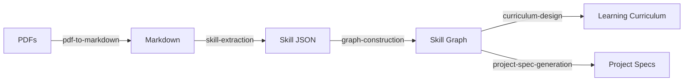

# Meta-Processing Toolkit

This directory contains reusable process skills and tools for extracting technical skills from PDFs and building learning curricula.

## Purpose

The meta-processing toolkit documents and automates the process of:
1. Converting technical PDFs to markdown
2. Extracting structured skills using LLMs
3. Building skill dependency graphs
4. Designing project-based learning curricula
5. Generating spec-based project requirements

## Directory Structure

```
meta/
├── skills/                          # Process documentation (Claude-style skills)
│   ├── pdf-to-markdown.md          # PDF → Markdown conversion
│   ├── skill-extraction-via-llm.md # Markdown → Skill extraction
│   ├── skill-graph-construction.md # Skills → Dependency graph
│   ├── curriculum-design.md        # Graph → Learning curriculum
│   └── project-spec-generation.md  # Skills → Project specs
│
├── scripts/                         # Implementation scripts
│   ├── pdf_to_markdown.py          # (existing)
│   ├── skill_extractor.py          # (existing)
│   ├── config.py                   # (existing)
│   └── (future scripts)
│
├── templates/                       # Reusable templates
│   ├── skill-schema.json           # (to be created)
│   ├── project-spec-template.md    # (to be created)
│   └── curriculum-template.md      # (to be created)
│
└── prompts/                         # LLM prompts
    └── skill_extraction.txt        # (existing)
```

## Skills Overview

### 1. PDF to Markdown (`pdf-to-markdown.md`)

**Purpose:** Convert technical PDFs to clean, structured markdown

**Key Topics:**
- PDF extraction tools comparison (pypdf, pdfplumber, marker)
- Chunking strategies (chapter-based, page-based, size-based)
- LLM prompt templates for markdown conversion
- Quality validation checklists
- Common issues (OCR artifacts, tables, code blocks)

**When to use:** Processing technical books, programming documentation

---

### 2. Skill Extraction via LLM (`skill-extraction-via-llm.md`)

**Purpose:** Extract structured skills from markdown using LLMs

**Key Topics:**
- Skill schema with emphasis on relationships (prerequisites, related skills)
- Prompt engineering for extraction
- Skill categorization taxonomy
- Dependency detection (explicit, implicit, LLM-assisted)
- Validation rules (required fields, consistency, circular dependencies)

**When to use:** Building skill taxonomies from technical content

---

### 3. Skill Graph Construction (`skill-graph-construction.md`)

**Purpose:** Build dependency graph enabling learning path generation

**Key Topics:**
- Graph data structures (nodes = skills, edges = prerequisites)
- Cycle detection and resolution
- Topological sorting for learning sequences
- Clustering skills by category/theme
- Identifying critical/foundational skills
- Export formats (JSON, markdown, Mermaid, Graphviz)

**When to use:** Creating navigable skill maps, finding learning order

---

### 4. Curriculum Design (`curriculum-design.md`)

**Purpose:** Generate project-based learning curricula from skill graphs

**Key Topics:**
- Learner profiling (level, focus, time commitment)
- Project scaffolding (skill clusters → projects)
- Difficulty progression strategies
- Time estimation methods
- Integration with reading materials
- Assessment criteria design

**When to use:** Creating personalized learning paths

---

### 5. Project Spec Generation (`project-spec-generation.md`)

**Purpose:** Create spec-based project requirements from skill clusters

**Key Topics:**
- Spec template structure (context, requirements, criteria)
- Realistic scenario generation (StoryBoard Analytics universe)
- Functional and non-functional requirements
- Acceptance criteria (testable conditions)
- Sample data specification
- Self-assessment rubrics

**When to use:** Generating practice projects for learning

---

## Usage Workflow

### End-to-End Process



### Step-by-Step

1. **Convert PDFs to Markdown**
   - Follow: `skills/pdf-to-markdown.md`
   - Input: Technical PDFs
   - Output: Clean markdown files

2. **Extract Skills from Markdown**
   - Follow: `skills/skill-extraction-via-llm.md`
   - Input: Markdown files
   - Output: JSON skill files (with prerequisites, tags, categories)

3. **Build Skill Graph**
   - Follow: `skills/skill-graph-construction.md`
   - Input: JSON skill files
   - Output: Skill graph (JSON, markdown, visualizations)

4. **Design Curriculum**
   - Follow: `skills/curriculum-design.md`
   - Input: Skill graph + learner profile
   - Output: Project-based learning curriculum

5. **Generate Project Specs**
   - Follow: `skills/project-spec-generation.md`
   - Input: Skill clusters + project themes
   - Output: Detailed project requirements

---

## Quick Start

### Prerequisites

- Python 3.11+
- Azure OpenAI API access (for LLM-based steps)
- uv package manager

### Example: Extract Skills from a Book

```bash
# Step 1: Convert PDF to markdown
uv run python meta/scripts/pdf_to_markdown.py \
  "references/Scaling Python with Dask.pdf"

# Step 2: Extract skills
uv run python meta/scripts/skill_extractor.py \
  "references/markdown/scaling-python-dask/full_content.md" \
  --output "references/_skill_taxonomy/"

# Step 3: Build graph (from multiple skill files)
uv run python meta/scripts/build_graph.py \
  --input-dir "references/_skill_taxonomy/" \
  --output "learning-paths/advanced-data-pro/skill_graph.json"

# Step 4: Generate curriculum
uv run python meta/scripts/generate_curriculum.py \
  --graph "learning-paths/advanced-data-pro/skill_graph.json" \
  --profile "advanced_data_pro" \
  --output "learning-paths/advanced-data-pro/curriculum.md"
```

---

## Cost Estimates

### Per Book (300 pages)

**PDF to Markdown:**
- Model: gpt-4o-mini
- Cost: ~$0.20 per book

**Skill Extraction:**
- Model: gpt-4o-mini
- Cost: ~$0.04 per book

**Total:** ~$0.24 per book (using mini models)

### Optimization Tips

- Use gpt-4o-mini for markdown conversion and skill extraction (quality is excellent, cost is minimal)
- Batch process multiple books in parallel
- Cache markdown conversions (reuse for multiple extraction attempts)
- Use chapter-based chunking for best quality

---

## Customization

### Adapting for Different Domains

**For non-Python technical content:**
- Update `KNOWN_DEPENDENCIES` in skill-extraction-via-llm.md
- Modify category taxonomy for your domain
- Adjust difficulty criteria

**For different learning styles:**
- Modify project scaffolding in curriculum-design.md
- Adjust time estimates for your audience
- Change project themes in project-spec-generation.md

---

## Contributing

These meta-skills are designed to be reusable and improvable. If you enhance a process:

1. Update the corresponding skill document
2. Add examples from real usage
3. Document edge cases and solutions
4. Update cost estimates if using different models

---

## License

Open source for educational purposes.

---

## Related Documentation

- **Design Document:** `docs/plans/2025-11-30-advanced-learning-path-design.md`
- **Learning Paths:** `learning-paths/`
- **Source PDFs:** `references/`
- **Skill Taxonomy:** `references/_skill_taxonomy/`

---

**Questions?** See the design document or individual skill files for detailed documentation.
